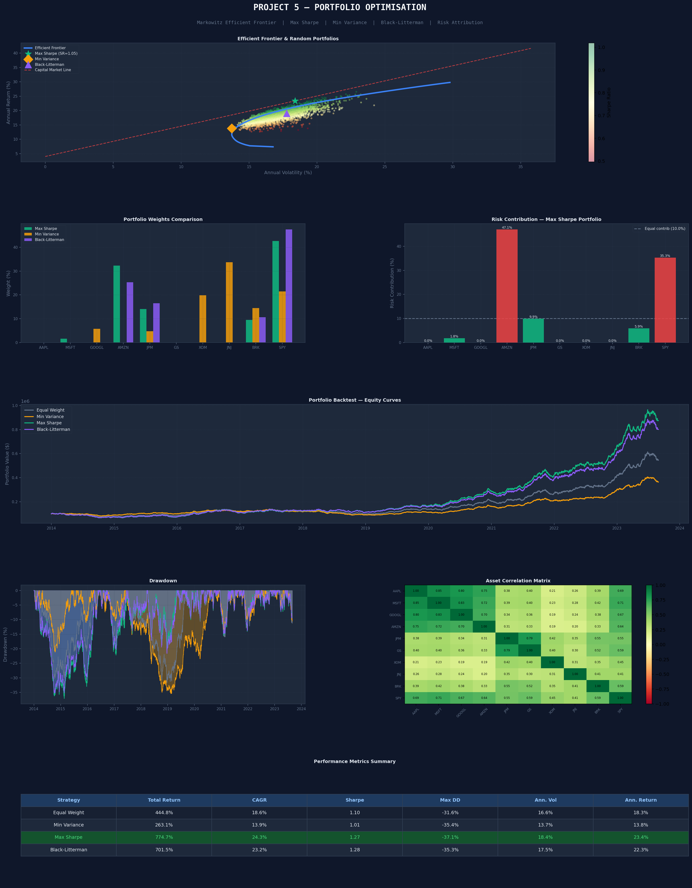

# Portfolio Optimisation — Markowitz & Black-Litterman

Full portfolio optimisation framework in Python — Efficient Frontier,
Max Sharpe, Min Variance, and Black-Litterman model.

## Tearsheet


## Results
- Max Sharpe: Return 23.4% | Sharpe 1.05
- Min Variance: Return 13.8% | Vol 13.7%
- Top holdings: SPY 42.6%, AMZN 32.3%, JPM 14.1%

## Models Built
- Markowitz Mean-Variance Optimisation
- Efficient Frontier (80 points)
- Maximum Sharpe Ratio Portfolio
- Minimum Variance Portfolio
- Black-Litterman (investor views blended with market)
- Monte Carlo (3,000 random portfolios)
- Risk Attribution per asset

## How to Run
pip3 install numpy pandas scipy matplotlib
python3 project5_portfolio.py

## Tech
Python · NumPy · SciPy · Matplotlib
``

Once all 7 quant repos are created your repositories page will show:
```
7 repositories
